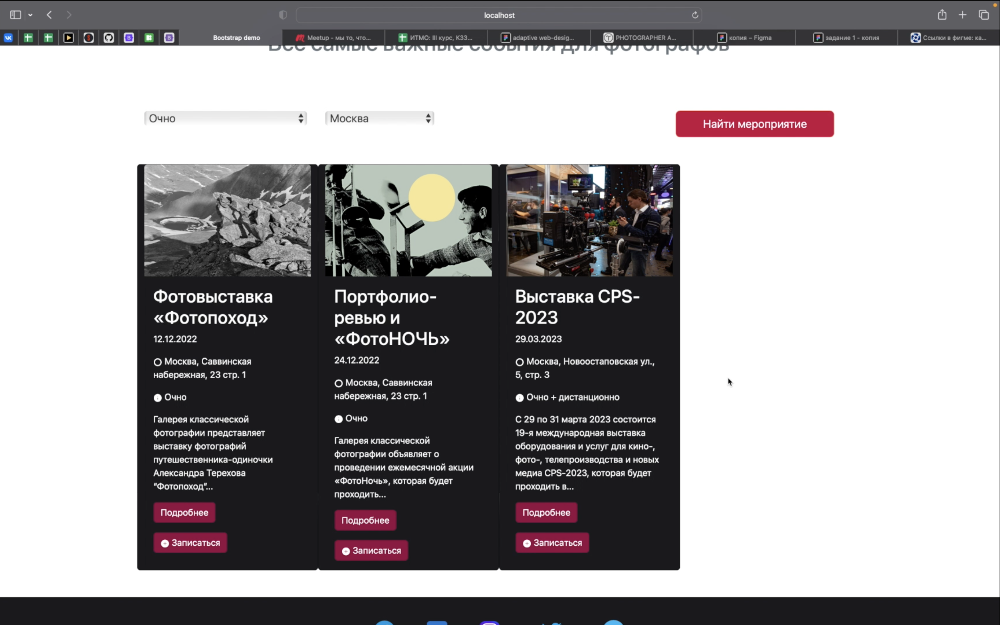
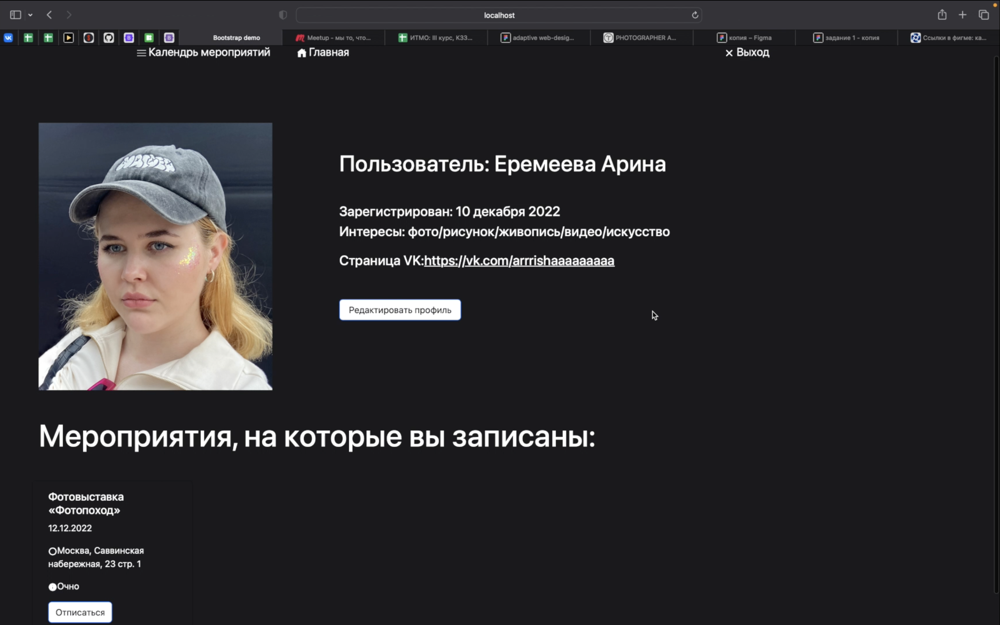
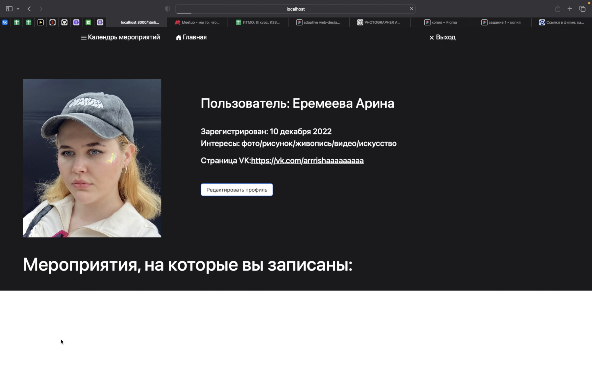

# Лабораторная работа №2

* `registration.html`

* Реализована аутентификация


```html 
<script>
			async function signup(event) {
				event.preventDefault()

				const inputs = Array.from(event.target.querySelectorAll('input'))

				const signupData = {}

				for (const input of inputs) {
					signupData[input.name] = input.value
				}

				console.log('sign up data', signupData)

				const response = await fetch('http://localhost:3000/signup', {
					method: "POST",
					body: JSON.stringify(signupData),
					headers: {
						'Content-Type': 'application/json'
					}
				})

				const responseJson = await response.json()

				const { accessToken, user } = responseJson

				console.log('response', responseJson)

				localStorage.accessToken = accessToken
				localStorage.user = JSON.stringify(user)

				window.location.href = "http://localhost:8000/html/entrance.html"
			}
</script>
```

* `entrance.html`

* Реализована авторизация и проверка наличия зарегистрированного пользователя


```html
<script>
		function checkAuth(response) {
			if (localStorage.accessToken) {
				if (response != 'Email and password are required') {
					if (response != 'Cannot find user') {
						if (response != 'Password is too short') {
							if (response != 'Incorrect password') {
								window.location.href = "http://localhost:8000/html/main.html"
							}
						} 
					}
				}
			}
		}

		async function login(event) {
			event.preventDefault()

			const inputs = Array.from(event.target.querySelectorAll('input'))

			const loginData = {}

			for (const input of inputs) {
				loginData[input.name] = input.value
			}

			console.log('login data', loginData)

			const response = await fetch('http://localhost:3000/login', {
				method: "POST",
				body: JSON.stringify(loginData),
				headers: {
					'Content-Type': 'application/json'
				}
			})

			const responseJson = await response.json()

			const { accessToken, user } = responseJson

			console.log('response', responseJson)

			localStorage.accessToken = accessToken
			localStorage.user = JSON.stringify(user)
			checkAuth(responseJson)
		}
</script>
```

* `main.html`

* Реализованы: фильтрация событий по типу мероприятия (очно/дистанционно) и городу (Москва/Санкт-Петербруг/Архангельск), функция проверки авторизации пользователя (в заисимости от того, авторизовн пользователь или нет, меняется контент в header), функция записи на мероприятие, выход из учетной записи

* Главная страница авторизованного пользователя


* Фильтрация карточек событий по типу мероприятия и городу


```html
<script>
			const idLogOut = document.querySelector('#logout');
			const idLogIn = document.querySelector('#enter');
			const enterLK = document.querySelector('#enterlk');
			const select = document.querySelector('.event-type');
			const result = document.querySelector('.region-type');
			const cards = document.querySelectorAll('.card')

			async function addNote(id) {
				const userId = JSON.parse(localStorage.user).id;
				const relation = {
					"userId": userId,
					"eventId": id
				}
				console.log(relation)
				const response = await fetch('http://localhost:3000/userEvents', {
					method: "POST",
					body: JSON.stringify(relation),
					headers: {
						'Content-Type': 'application/json'
					}
				})
			}

			select.addEventListener('change', (event) => {
					const { value } = event.target
			})

			result.addEventListener('change', (event) => {
				const { value } = event.target
			})

			function filter() {
				const searchForm = document.querySelector('.search-form')
				searchForm.addEventListener('submit', (event) => {
					event.preventDefault()
					const eventTypeValue = select.value
					const regionValue = result.value
					console.log(eventTypeValue)
					console.log(regionValue)
					
					switch(eventTypeValue) {
						case 'all':
							cards.forEach(card => {
								if (card.classList.contains(regionValue)) {
									card.style.display = 'block'
							 } else {
									card.style.display = 'none'
								}
							}) 
									break
						case 'active':
							cards.forEach(card => {
								if (card.classList.contains('active') && card.classList.contains(regionValue)) {
									card.style.display = 'block'
								} else {
									card.style.display = 'none'
								}
							})
							break
						case 'theatre':
						cards.forEach(card => {
							if (card.classList.contains('theatre') && card.classList.contains(regionValue)) {
								card.style.display = 'block'
							} else {
								card.style.display = 'none'
							}
						})
						break
					}
				})
			}
					
			function logout() {
				localStorage.clear();
				window.location.href = "http://localhost:8000/html/entrance.html";
			}

			function check() {
				if (localStorage.accessToken){
					idLogIn.classList.add("d-none")
				}
				else {
					idLogIn.classList.remove("d-none")
				}
			}

			function checkenter() {
				if (!localStorage.accessToken){
					enterLK.classList.add("d-none");
					idLogOut.classList.add("d-none")
				}
			}

			checkenter();
			check();
			filter()
			idLogOut.addEventListener('click', logout)
</script>
```

* `lk.html`

* Реализованы: функция проверки авторизации пользователя (в заисимости от того, авторизовн пользователь или нет, меняется контент в header), функция отображения карточек мероприятий, на которые записан пользователь, личный кабинет, выход из учетной записи

* Личный кабинет и отображение карточек мероприятий, на которые записался пользователь


* Отписались от первого мероприятия


```html
<script>
			const idLogOut = document.querySelector('#logout')
			const userId = JSON.parse(localStorage.user).id; 
			let users = []; 
			let events = []; 
			const myUsersEvents = []; 
			const myEvents = []; 
			const mainId = []
			
			async function getUsers() { 
				const response = await fetch('http://localhost:3000/userEvents', { 
					headers: { 
						'Content-Type': 'application/json' 
					} 
				}) 
				const jsonResponse = await response.json(); 
				console.log('response', jsonResponse); 
				jsonResponse.forEach(user => { 
					if (user.userId === userId) { 
						myUsersEvents.push(user.eventId); 
						mainId.push(user);
					} 
				}) 
			} 
			
			async function getEvents() { 
				const response = await fetch('http://localhost:3000/notes', { 
					headers: { 
					'Content-Type': 'application/json' 
					} 
				}) 
				const jsonResponse = await response.json(); 
				console.log('response', jsonResponse); 
				events = jsonResponse; 
				console.log(events) 
				events.forEach(item => { 
					if (myUsersEvents.includes(item.id)) {
						myEvents.push(item) 
					} 
				})
				console.log("myevents", myEvents)
				console.log("myeventsuser", myUsersEvents)
				console.log("main", mainId) 
				for (let i = 0; i < myEvents.length; i++ ) { 
					document.querySelector("#container").innerHTML += getCardHtml(myEvents[i].id, myEvents[i].mero, myEvents[i].data, myEvents[i].metro, myEvents[i].address, myEvents[i].id); 
				} 
			}

			async function deleteCard(event, id) { 
				for (let i = 0; i < mainId.length; i++) {
					if (id === mainId[i].eventId && userId === mainId[i].userId) {
						const link = 'http://localhost:3000/userEvents/' + mainId[i].id;
						console.log(link);
						const response = await fetch(link, {
							method: "DELETE",
							headers: {
								'Content-Type': 'application/json'
							}
						})
					}
				}
			}

			function getCardHtml(id, mero, data, metro, address) {
				return `
				<div class="card card-color mx-5 mb-5" data-card-id=${id} style="width: 18rem;">
						<div class="card-body">
							<h5 class="card-title text-card">${mero}</h5>
							<p class="card-text text-card">${data}</p>
							<p class="card-text text-card">
								<svg class="icon-main">
									<use xlink:href="#addr"></use>
								</svg>${address}</p>
							<p class="card-text text-card">
								<svg class="icon-main">
									<use xlink:href="#type"></use>
								</svg>${metro}</p>
							<form onsubmit="deleteCard(event, ${id})">
								<button type="submit" class="btn btn-primary button-color">Отписаться</button>
							</form>
						</div>
					</div> `
			}

			function logout() {
				localStorage.clear();
				window.location.href = "http://localhost:8000/html/entrance.html";
			}
			idLogOut.addEventListener('click', logout)

			getUsers();
			getEvents();
</script>
```